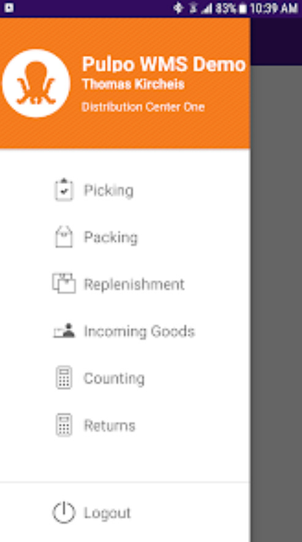

## Framework

`06.2023 ~ 08.2023`

PULPO WMS APP for your warehouse staff. Optimize all processes inside your warehouse:

- Incoming goods
- Picking
- Packing
- Replenishment
- Returns
- Inventory

To be used with our cloud PULPO Warehouse Management System from https://www.pulpowms.com

#### Category

`Flutter` `Mobile`

|          Technology          |    Client     |
| :--------------------------: | :-----------: |
| Flutter, Auto-Route, OpenAPI | United States |

|   App   |                                   Link                                   |
| :-----: | :----------------------------------------------------------------------: |
| Android | [Link](https://play.google.com/store/apps/details?id=com.uplift.android) |

|           Images            |
| :-------------------------: |
|  |
|  |
|  |
